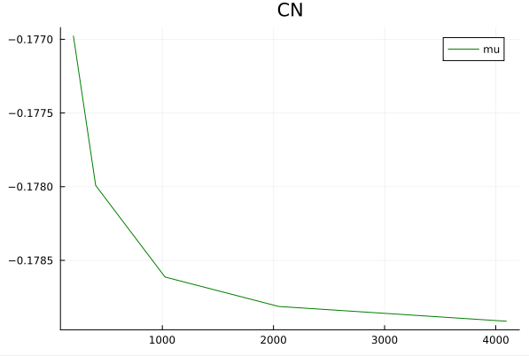

#### 10/07
- [ ] formalize the correctness of the simulations
  - obtain a simple check of the numeric properties of the simulations
  - do not rely on default values 
- [ ] speed up NPSE+ with manual solver
  - is it possible to obtain really fast automatic solvers?? 
  - it it possible to have only one code for automatic and manual solvers? seems not

- [ ] try to fix memory problem by calling GC.gc() on memory filling

##### which are the major concerns on correctness? 
- ground states: NPSE+ performs worst than GPE-3D.

> we may take advantage in reducing very much the axial points in order to improve the transverse part.
> How about going to second order??
> 

## EXPLORE the impact of second order algorithm in the D=1 case

- [x] clean up the simulations
- [ ] setup the spatial discretization sim for 1D
1D --> 0.01 accuracy is obtained using $dt<0.05$, $N>2048$ [GPE-1D]
3D --> 0.05 accuracy is obtaines using $dt<0.05$, $N_trans>400$ [GPE-3D]
- [ ] Why our Crank Nicholson is not ready??
- [ ] eventually study the effect of second order splitting on 1D

### SSFM is second order accurate in time and accurate to every order in space
By changing the spatial discretization (and consequently the normalization of the transforms), we have DFT corresponds to the sampled Fourier series.

  --> the new accuracies are super good ()
  